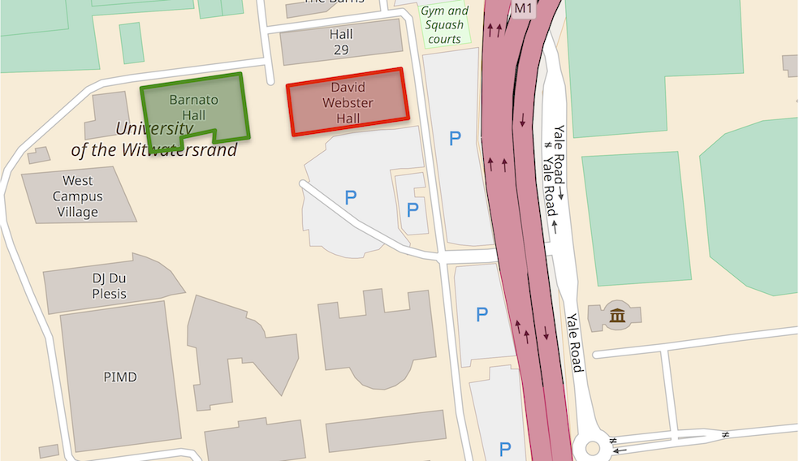
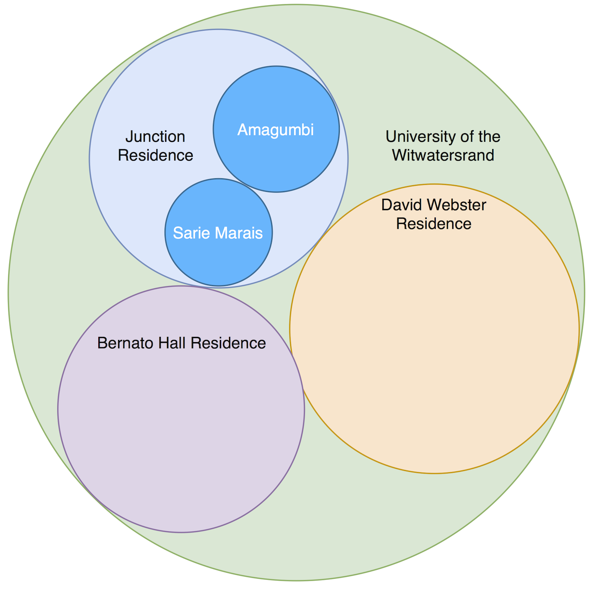

# Visualisations

## Campus Map
The campus map is one of the remaining two visualisations that still need to be implemented.
A choropleth map is to be created where the shading represents the energy consumption of the building relative 
to the other buildings

## Circular Tree Map
The circular tree is the other visualisation that still needs to be implemented. 
In the circular tree map, the areas of the circles will represent the consumption of a building. 
The parent circle, indicating the group of buildings (for example a residence cluster), will be sized 
according the the sizes of its children. In this way, the sizes of the circles will be indicative 
of the consumption of the building or cluster of buildings relative to the other buildings in the diagram.

## Word Cloud
The word cloud is not needed for the project, but it is an interesting visualisation.
This cloud was created using the project report. From the word cloud, the themes of the report are clear:

**_The project presents a user-centric approach to creating a visualisation system to look at the university's consumption data_**
  

