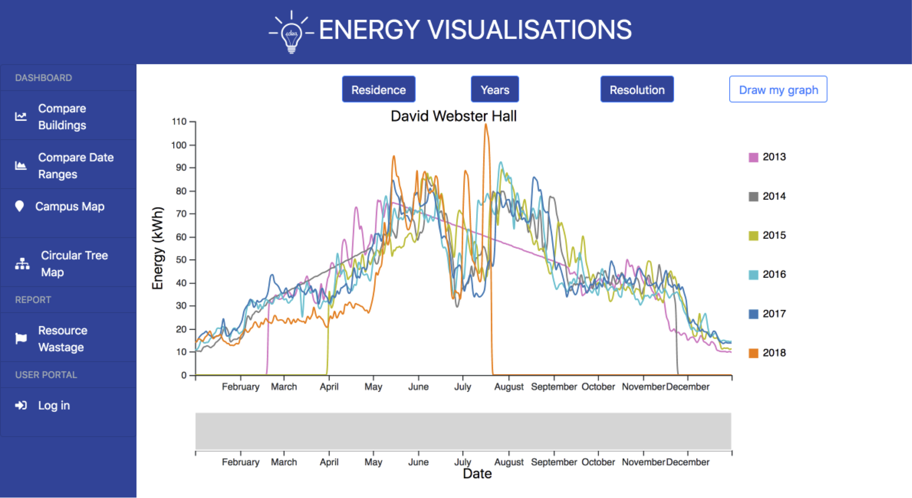

# University of the Witwatersrand Resource Analytics and Visualisations

This repository contains the code base for a resource visualisations MVP that is hosted as an Azure App service. The website can be accessed [here](https://energy-analytics.azurewebsites.net). The system uses an OpenTSDB database which is hosted on a Google Cloud VM.

## About the project
The project required the design of a system for visualising resource consumption on a university campus. The system was designed to meet the requirements of the university's upper level management, and was predominately designed for management to use. These requirements were to create comparative visualisations so that large resource consumers can be identified and measures can be taken to reduce the consumption of these buildings. The two visualisations implemented in the MVP are a line graph which performs a building-by-building comparison over the same year and one which does a year-on-year comparisons for the same building, 

The designed system is a single page web application that displays the above mentioned visualisations. The visualisations can be customised by the user in terms of the data and the time period to be displayed. The system uses a Node.js server, Express router and OpenTSDB and MySQL databases. The D3 JS library was used to create the visualisations. The implementation of the MVP made use of an Agile methodology, which was implemented using the Scrum framework. The scrum board used in the board can be found in the Projects tab

## Using the codebase
**Note**: Incoming traffic on unknown IP addresses has been blocked on the database server for security reasons. If you wish to test the data retrieval, please use the live site.

Before running the project, the required packages must be installed. To do this run:

`npm install`

To run the project locally run:

`node index`

The application will then be avaliable at [http://localhost:3000/](http://localhost:3000/)

To run this system on a local device, an OpenTSDB database needs to be configured, and the IP address of the database must be used as the host for the OpenTSDB client in `mainRoutes.js`

## Energy Visualisation Demonstration

